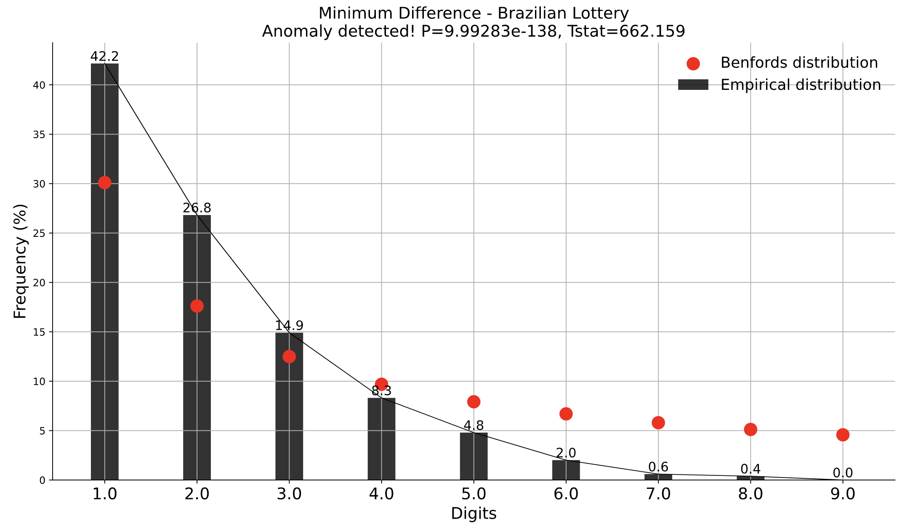

# Brazilian Lottery Analysis

Data of the Brazilian federal loterry from 1996 to 2021.

The most common minimum difference between drawn numbers is 1.

## Benford's Law

I used Benford's Law here just for fun. It would say that we have an anomaly in the data.

<b>We probably shouldn't use Benford's Law for the minimum differences because we don't have the required circumstances covered for it.</b>

According to <a href= "https://www.isaca.org/resources/isaca-journal/past-issues/2011/understanding-and-applying-benfords-law">ISACA</a>,
some data sets that are not likely to be suitable for Benford’s Law include:

- Airline passenger counts per plane
- Telephone numbers
- Data sets with 500 or fewer transactions
- Data generated by formulas (e.g., YYMM#### as an insurance policy number)
- Data restricted by a maximum or minimum number (e.g., hourly wage rate)

